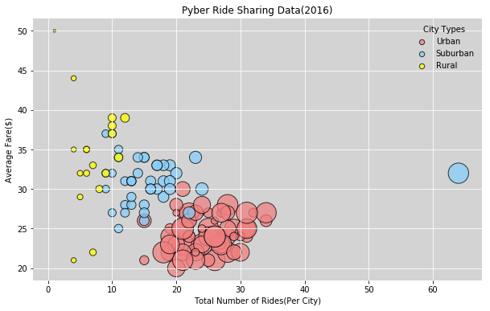
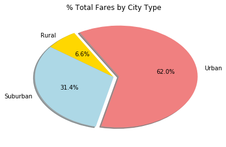
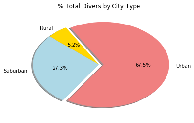

## Ride Sharing

### Observations

* Urban cities have the highest number of rides representing 68% of the total rides for the three city types.
  They have majority of the lowest average fare representing as inversely proportional relationship between the number
  of rides and the average fare. 

* The average fare in rural cities is high as compared to the number of rides, representing an inverse proprtion betweeen
  the number of rides and the average fare.

* Suburban cities are in the middle except for an outlier(Port James), where the number of rides are the highest of the 
  three city types, but the average fare is in between the highest and the lowest average fare of suburban cities.

import os
import pandas as pd
import numpy as np
import matplotlib.pyplot as plt


```python
city_path = os.path.join("Pyber", "raw_data", "city_data.csv")
ride_path = os.path.join("Pyber", "raw_data", "ride_data.csv")
```


```python
city_data_df= pd.read_csv(city_path)
ride_data_df= pd.read_csv(ride_path)
```


```python
combined_df = pd.merge(ride_data_df, city_data_df, on="city", how="outer")
combined_df = combined_df.set_index("city")
```


```python
urban_df = combined_df[combined_df["type"]=="Urban"]
udrivercount = urban_df.groupby("city")["driver_count"].mean()
uavg_fare = round(urban_df.groupby("city")["fare"].mean())
urides_per_city = urban_df.groupby("city")["ride_id"].count()
```


```python
suburban_df = combined_df[combined_df["type"]=="Suburban"]
sdrivercount = suburban_df.groupby("city")["driver_count"].size()
savg_fare = round(suburban_df.groupby("city")["fare"].mean())
srides_per_city = suburban_df.groupby("city")["ride_id"].count()
```


```python
rural_df = combined_df[combined_df["type"]=="Rural"]
rdrivercount = rural_df.groupby("city")["driver_count"].size()
ravg_fare = round(rural_df.groupby("city")["fare"].mean())
rrides_per_city = rural_df.groupby("city")["ride_id"].count()
```


```python
plt.figure(figsize=(10,6))
for spine in plt.gca().spines.values():
    spine.set_visible(False)
plt.grid(color="white", linestyle="solid")
plt.title("Pyber Ride Sharing Data (2016)")
plt.xlabel("Total Number of Rides(Per City)")
plt.ylabel("Average Fare($)")
```


    Text(0,0.5,'Average Fare($)')


```python
urban_handle = plt.scatter(urides_per_city, uavg_fare, s=udrivercount*10, facecolors= "lightcoral", edgecolors="black",
                           alpha=0.75, linewidth=1, label="Urban")
suburban_handle = plt.scatter(srides_per_city, savg_fare, s=sdrivercount*10, facecolors= "lightskyblue", edgecolors="black",
                              alpha=0.75, linewidth=1, label="Suburban")
rural_handle = plt.scatter(rrides_per_city, ravg_fare, s=rdrivercount*10, facecolors= "yellow", edgecolors="black",
                           alpha=0.75, linewidth=1, label="Rural")

```

### The Bubble Plot showcases relationship between four key variables:

* Average Fare ($) Per City
* Total Number of Rides Per City
* Total Number of Drivers Per City
* City Type (Urban, Suburban, Rural)


```python
lgnd = plt.legend(handles=[urban_handle, suburban_handle, rural_handle], loc="upper right", title='City Types', frameon=False)
for handle in lgnd.legendHandles:
    handle.set_sizes([40])
plt.show()
```





```python
#total fares by city type
city_fare = combined_df.groupby("type")["fare"].sum()
total_city_fare = combined_df["fare"].sum()
percent_fare = city_fare/total_city_fare * 100
```


```python
labels = ["Rural", "Suburban", "Urban"]
fares = [percent_fare[0], percent_fare[1], percent_fare[2]]
colors = ["gold", "lightblue", "lightcoral"]
explode = (0,0,0.07)
plt.pie(fares, explode=explode, labels=labels, colors=colors,
        autopct="%1.1f%%", shadow=True, startangle=120)
plt.title("% Total Fares by City Type")
plt.show()
```





```python
#total rides by city type
city_ride = combined_df.groupby("type")["ride_id"].count()
total_rides = combined_df["ride_id"].count()
percent_rides = city_ride/total_rides * 100
```


```python
labels = ["Rural", "Suburban", "Urban"]
rides = [percent_rides[0], percent_rides[1], percent_rides[2]]
colors = ["gold", "lightblue", "lightcoral"]
explode = (0, 0, 0.07)
plt.pie(rides, explode=explode, labels=labels, colors=colors,
        autopct="%1.1f%%", shadow=True, startangle=120)
plt.title("% Total Rides by City Type")
plt.show()
```


```python
#total drivers by city type
city_driver = combined_df.groupby("type")["driver_count"].count()
total_drivers = combined_df["driver_count"].count()
percent_drivers = city_driver/total_drivers*100
```


```python
labels = ["Rural", "Suburban", "Urban"]
drivers = [percent_drivers[0], percent_drivers[1], percent_drivers[2]]
colors = ["gold", "lightblue", "lightcoral"]
explode = ((0,0,0.07))
plt.pie(drivers, explode=explode, labels=labels, colors=colors,
        autopct="%1.1f%%", shadow=True, startangle=120)
plt.title("% Total Divers by City Type")
plt.show()
```




