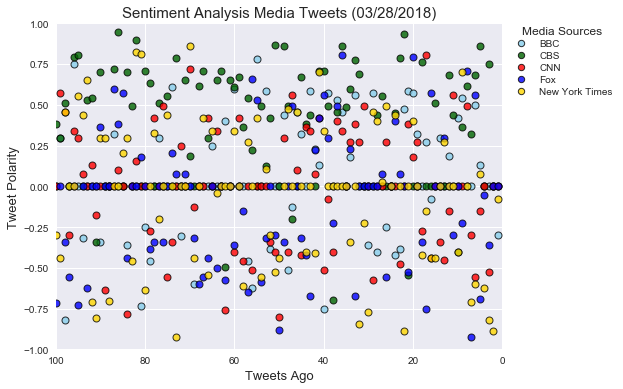
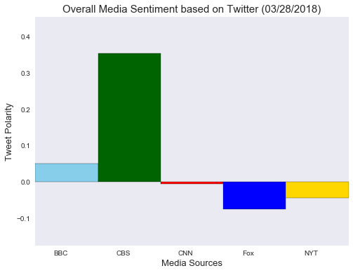

## Sentiment Analysis of the Twitter Activity of News Organizations

This Python Script provides a visualized summary of the sentiments expressed in tweets sent out by the news organizations: 
BBC, CBS, CNN, Fox, and NYT.

* Pulls last 100 tweets from each outlet.
* Performs a sentiment analysis with the compound, positive, neutral, and negative scoring for each tweet. 

### Scatter Plot

* Visualizes the sentiments of the last 100 tweets sent out by each news organization, ranging from -1.0 to 1.0, where a 
  score of 0 expresses a neutral sentiment, -1 the most negative sentiment possible, and +1 the most positive sentiment possible.
* Each plot point reflects the _compound_ sentiment of a tweet.
* Each plot is sorted by its relative timestamp.

### Bar Plot

* Visualizes the _overall_ sentiments of the last 100 tweets from each organization. 
* The compound sentiments are aggregarted and analyzed by VADER.


### Observations

* The overall positive sentiment of CBS is three times greater than that of the next most positive sentiment, BBC, as 
  observed from the Bar plot. Majority of the positive sentiments of CBS have polarities in the 0.50 - 1.00 range. 
  Negative sentiment makes up for only about 5-6% of its sentiments. CBS singularly makes the entire dataset look more 
  positive.

* The sentiment of CNN is the most neutral of all media sources in this dataset. More than 75% of the sentiments have 
  polarities ranging between -0.5 and 0.5. The sentiments in the last 35-55 tweets show a polrizing effect, possibly from 
  an event that seems to have split the sentiment of tweets on either side. 

* The sentiments of New York Times are spread almost evenly across positive, negative and neutral; although the polarity of
  of the negative sentiments is on the higher side. The negative sentiment of Fox news outweighs the positive,  
  whereas the positive sentiment of BBC outweighs the negative, as interpreted from the Scatter plot. 


```python
import csv
import pandas as pd
import tweepy
import matplotlib.pyplot as plt
import seaborn as sns
import numpy as np
from datetime import datetime

from vaderSentiment.vaderSentiment import SentimentIntensityAnalyzer
analyzer = SentimentIntensityAnalyzer()

consumer_key = "LMtZORnSAtkcqudxzHjKWTRlH"
consumer_secret = "K2a1pPsJwnmcM2N3DXvUWbp3Afx9vcOYgbSNKnaN7nwZ5vhVMb"
access_token = "975046253020000256-FPDkdEiXyXVfjQhVAVTbgDPrbN9WCft"
access_token_secret = "QZDWyiLSNtOKbIvp9LFWhw3KZ33rkWixaN1h1Hh1Cxe02"

auth = tweepy.OAuthHandler(consumer_key, consumer_secret)
auth.set_access_token(access_token, access_token_secret)
api = tweepy.API(auth, parser=tweepy.parsers.JSONParser())
```


```python
source_account=[]
date=[]
all_texts=[]
compound_list=[]
positive_list=[]
negative_list=[]
neutral_list=[]

target_user = ['@BBC', '@CBS', '@CNN', '@FoxNews', '@nytimes']
        
for user in target_user:
        
        public_tweets = api.user_timeline(user, count=100, result_type ="recent")        
    
        for tweet in public_tweets:
       
            account = tweet["user"]["name"]
            source_account.append(account)
            
            tweet_date = tweet["created_at"]
            converted_date = datetime.strptime((tweet_date), "%a %b %d %H:%M:%S %z %Y")
            dt = datetime.date(converted_date)
            formatted_date = dt.strftime('%m/%d/%Y')
            date.append(formatted_date)
        
            all_texts.append(tweet["text"])
        
            compound_list.append(analyzer.polarity_scores(tweet["text"])["compound"])
            positive_list.append(analyzer.polarity_scores(tweet["text"])["pos"])
            negative_list.append(analyzer.polarity_scores(tweet["text"])["neg"])
            neutral_list.append(analyzer.polarity_scores(tweet["text"] )["neu"])    
```


```python
sentiments_df = pd.DataFrame({
    "Source Account":source_account,
    "Date":date,
    "Text":all_texts,
    "Compound":compound_list,
    "Positive":positive_list,
    "Negative":negative_list,
    "Neutral":neutral_list
})
sentiments_df = sentiments_df[["Source Account","Date","Text","Compound","Positive","Negative","Neutral"]]
sentiments_df.to_csv("sentiments_csv", index=False)
sentiments_df.head()
```


<div>
<style>
    .dataframe thead tr:only-child th {
        text-align: right;
    }

    .dataframe thead th {
        text-align: left;
    }

    .dataframe tbody tr th {
        vertical-align: top;
    }
</style>
<table border="1" class="dataframe">
  <thead>
    <tr style="text-align: right;">
      <th></th>
      <th>Source Account</th>
      <th>Date</th>
      <th>Text</th>
      <th>Compound</th>
      <th>Positive</th>
      <th>Negative</th>
      <th>Neutral</th>
    </tr>
  </thead>
  <tbody>
    <tr>
      <th>0</th>
      <td>BBC</td>
      <td>03/28/2018</td>
      <td>🇮🇪 This 800-year-old hotel in Ireland is simpl...</td>
      <td>0.0000</td>
      <td>0.000</td>
      <td>0.000</td>
      <td>1.000</td>
    </tr>
    <tr>
      <th>1</th>
      <td>BBC</td>
      <td>03/28/2018</td>
      <td>📚 'Words do not live in dictionaries. They liv...</td>
      <td>0.2960</td>
      <td>0.109</td>
      <td>0.000</td>
      <td>0.891</td>
    </tr>
    <tr>
      <th>2</th>
      <td>BBC</td>
      <td>03/28/2018</td>
      <td>The government rates the global outbreak of a ...</td>
      <td>-0.8225</td>
      <td>0.000</td>
      <td>0.312</td>
      <td>0.688</td>
    </tr>
    <tr>
      <th>3</th>
      <td>BBC</td>
      <td>03/28/2018</td>
      <td>Slacking off in Dubai. https://t.co/a3oSKIxfSK</td>
      <td>0.0000</td>
      <td>0.000</td>
      <td>0.000</td>
      <td>1.000</td>
    </tr>
    <tr>
      <th>4</th>
      <td>BBC</td>
      <td>03/28/2018</td>
      <td>RT @BBCTheOneShow: The fantastic @george_ezra ...</td>
      <td>0.7506</td>
      <td>0.280</td>
      <td>0.000</td>
      <td>0.720</td>
    </tr>
  </tbody>
</table>
</div>


```python
bbc_df = sentiments_df.loc[sentiments_df["Source Account"] == "BBC", ["Compound"]]
bbc_x = np.arange(-len(bbc_df), 0, 1)
bbc_x = -(bbc_x)
```


```python
cbs_df = sentiments_df.loc[sentiments_df["Source Account"] == "CBS", ["Compound"]]
cbs_x = np.arange(-len(cbs_df), 0, 1)
cbs_x = -(cbs_x)
```


```python
cnn_df = sentiments_df.loc[sentiments_df["Source Account"] == "CNN", ["Compound"]]
cnn_x = np.arange(-len(cnn_df), 0, 1)
cnn_x = -(cnn_x)
```


```python
fox_df = sentiments_df.loc[sentiments_df["Source Account"] == "Fox News", ["Compound"]]
fox_x = np.arange(-len(fox_df), 0, 1)
fox_x = -(fox_x)
```


```python
nyt_df = sentiments_df.loc[sentiments_df["Source Account"] == "The New York Times", ["Compound"]]
nyt_x = np.arange(-len(nyt_df), 0, 1)
nyt_x = -(nyt_x)
```


```python
sns.set()
plt.figure(figsize=(8,6))
plt.xlim(100,0)
plt.ylim(-1.0,1.0)
plt.title(f'Sentiment Analysis Media Tweets ({sentiments_df.iloc[0,1]})',fontsize=15)
plt.ylabel("Tweet Polarity",fontsize=13)
plt.xlabel("Tweets Ago",fontsize=13)

plt.scatter(bbc_x, bbc_df["Compound"],facecolor="skyblue", edgecolors="black", linewidth=1, alpha=0.8, label="BBC")
plt.scatter(cbs_x, cbs_df["Compound"],facecolor="darkgreen", edgecolors="black", linewidth=1, alpha=0.8, label="CBS")
plt.scatter(cnn_x, cnn_df["Compound"],facecolor="red", edgecolors="black", linewidth=1, alpha=0.8, label="CNN")
plt.scatter(fox_x, fox_df["Compound"],facecolor="blue", edgecolors="black", linewidth=1, alpha=0.8, label="Fox")
plt.scatter(nyt_x, nyt_df["Compound"],facecolor="gold", edgecolors="black", linewidth=1, alpha=0.8, label="New York Times")

lgnd = plt.legend(fontsize="small", 
                  numpoints=1, scatterpoints=1, 
                  loc="lower left", title="Media Sources", 
                  bbox_to_anchor=(1.0,0.75),
                  labelspacing=0.3)
for handle in lgnd.legendHandles:
    handle.set_sizes([40])

plt.savefig("Tweet Sentiment Analysis.png")
plt.show()
```





```python
sns.set_style("dark")
plt.figure(figsize=(8,6))
plt.title(f'Overall Media Sentiment based on Twitter ({sentiments_df.iloc[0,1]})',fontsize=15)
plt.ylabel("Tweet Polarity",fontsize=13)
plt.xlabel("Media Sources",fontsize=13)

overall_sentiment = sentiments_df.groupby("Source Account")["Compound"].mean()
x_axis = np.arange(len(overall_sentiment))
y_axis = overall_sentiment
colors = ["skyblue","darkgreen","red","blue","gold"]
edgecolors = ["black","black","black","black","black"]

plt.bar(x_axis, y_axis, width = 1, align="edge", color=colors, edgecolor=edgecolors)
tick_locations = [value+0.4 for value in x_axis]
plt.xticks(tick_locations, ["BBC", "CBS", "CNN", "Fox", "NYT"])
plt.xlim(0, len(x_axis))
plt.ylim(min(y_axis)-0.1, max(y_axis)+0.1)

plt.savefig("Overall Media Sentiment.png")
plt.show()
```




